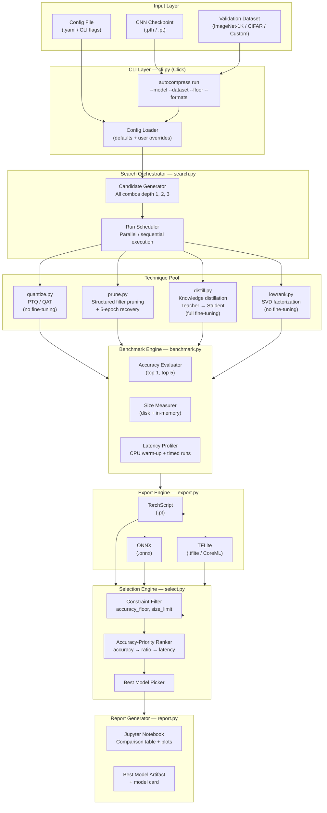

# 02 — System Architecture

## AutoCompress — Full Technical Architecture

---

## 1. Architecture Overview

AutoCompress is structured as a **layered Python package** with a CLI entry point, five core processing layers, and three export paths.



---

## 2. Module Breakdown

### 2.1 CLI Layer — `cli.py`

| Responsibility | Implementation |
|---|---|
| Argument parsing | Click decorators; all flags have documented defaults |
| Config loading | YAML config file merged with CLI overrides |
| Run orchestration | Calls Search Orchestrator; captures exit codes |

**Key CLI flags:**

```bash
autocompress run \
  --model resnet50 \               # torchvision model name or path to .pth
  --dataset imagenet \             # imagenet | cifar10 | cifar100 | /path/to/data
  --accuracy-floor 0.98 \          # minimum accuracy retention (default 0.98)
  --compression-min 2.0 \          # minimum compression ratio (default 2.0)
  --latency-max 1.5 \              # max latency multiplier vs baseline (default 1.5)
  --search-depth 3 \               # max technique stack depth (default 3)
  --formats torchscript,onnx,tflite \
  --output ./results/              # output directory for models + notebook
```

---

### 2.2 Search Orchestrator — `search.py`

Generates all valid technique combinations up to the specified depth:

| Depth | Candidates | Examples |
|---|---|---|
| 1 (single) | 4 | `[quant]`, `[prune]`, `[distill]`, `[lowrank]` |
| 2 (pairs) | 6 | `[prune→quant]`, `[distill→quant]`, `[lowrank→quant]`, ... |
| 3 (triples) | 4 | `[prune→lowrank→quant]`, `[distill→prune→quant]`, ... |
| **Total** | **14** | — |

> [!NOTE]
> Order within stacks matters. The orchestrator enforces a **logical ordering constraint**: distillation must come before pruning or quantization (you distill into a student first, then compress that student further). Quantization is always the last step.

---

### 2.3 Technique Modules — `techniques/`

All four modules implement a **common interface**:

```python
class CompressionTechnique(Protocol):
    def compress(self, model: nn.Module, config: TechniqueConfig) -> nn.Module:
        """Apply compression and return modified model."""
    def describe(self) -> str:
        """Human-readable description of what was applied."""
```

#### `quantize.py`
- **PTQ (Post-Training Quantization):** `torch.quantization.quantize_dynamic` — applies INT8 to Linear/Conv layers; zero fine-tuning
- **QAT (Quantization-Aware Training):** Inserts fake quantization nodes; requires training loop; selected when `--qat` flag is set
- Output: quantized PyTorch model (INT8 weights)

#### `prune.py`
- Uses `torch-pruning` library (structured, L1-norm filter importance)
- Prunes a configurable fraction of filters per layer (default 30%)
- Followed by 5-epoch fine-tuning recovery loop with cosine LR schedule
- Output: structurally smaller model (fewer channels)

#### `distill.py`
- Teacher = original full model (frozen)
- Student = smaller architecture (MobileNetV2 default, or user-specified)
- Loss: `α × CE(student_logits, labels) + (1-α) × KL(student_soft / T, teacher_soft / T)`
- Full training with early stopping (patience=5 epochs)
- Output: trained student model

#### `lowrank.py`
- Applies Truncated SVD to weight matrices of Conv and Linear layers
- Rank ratio configurable (default 0.5 — keep top 50% singular values)
- No fine-tuning; operates purely on weight tensors
- Output: model with factorized layers (replaced by two smaller layers)

---

### 2.4 Benchmark Engine — `benchmark.py`

Runs the **same harness** on every candidate model to guarantee fair comparison:

```
For each candidate model:
  1. Load model in eval mode
  2. Warm-up: 10 forward passes (discarded)
  3. Accuracy: evaluate on full validation split (top-1, top-5)
  4. Size: measure .pt disk size + count non-zero parameters
  5. Latency: 100 timed forward passes; report mean ± std
  6. All metrics logged to candidate_results.csv
```

---

### 2.5 Export Engine — `export.py`

| Format | Tool | Output |
|---|---|---|
| TorchScript | `torch.jit.script()` | `.pt` — runs anywhere PyTorch is installed |
| ONNX | `torch.onnx.export()` | `.onnx` — cross-framework, runs in ONNX Runtime |
| TFLite | ONNX → `onnx-tf` → `tf.lite.TFLiteConverter` | `.tflite` — Android/iOS native; INT8 compatible |

> [!WARNING]
> The ONNX → TFLite conversion chain has known operator coverage gaps. A fallback compatibility checker runs post-export; unsupported ops are logged and flagged in the report.

---

### 2.6 Selection Engine — `select.py`

Two-stage filtering and ranking:

1. **Constraint filter:** Drop any candidate where `accuracy_retention < floor` OR `compression_ratio < min` OR `latency_multiplier > max`
2. **Priority ranker:** Sort remaining candidates by `(accuracy_retention DESC, compression_ratio DESC, latency DESC)`
3. **Winner:** Top-ranked candidate across all three export formats

---

### 2.7 Report Generator — `report.py`

Generates a Jupyter Notebook (`.ipynb`) using `nbformat`:

- **Section 1:** Run configuration summary
- **Section 2:** Baseline model stats
- **Section 3:** Candidate comparison table (all 14+ candidates)
- **Section 4:** Plots — accuracy vs compression ratio scatter, latency bar chart, format size comparison
- **Section 5:** Best model card — technique stack, metrics, export paths
- **Section 6:** Reproduction instructions

---

## 3. Directory Layout

```
autocompress/
├── cli.py                  # Click CLI entry point
├── search.py               # Candidate generator + run scheduler
├── benchmark.py            # Shared benchmark harness
├── export.py               # TorchScript / ONNX / TFLite export
├── select.py               # Constraint filter + accuracy ranker
├── report.py               # Jupyter notebook generator
├── techniques/
│   ├── __init__.py
│   ├── base.py             # CompressionTechnique Protocol
│   ├── quantize.py
│   ├── prune.py
│   ├── distill.py
│   └── lowrank.py
├── data/
│   ├── loaders.py          # Dataset loader factory (ImageNet / CIFAR / custom)
│   └── calibration.py      # Calibration set sampler for PTQ
├── utils/
│   ├── model_loader.py     # torchvision + custom checkpoint loader
│   ├── metrics.py          # Accuracy / size / latency helpers
│   └── compat.py           # ONNX op coverage checker
└── tests/
    ├── test_techniques.py
    ├── test_benchmark.py
    └── test_export.py
```
