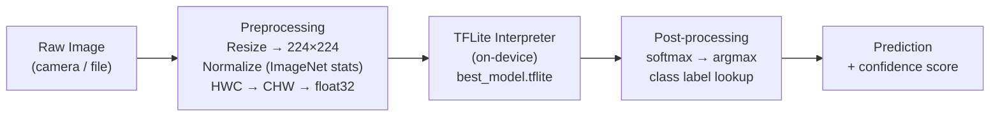

# 03 — Data Flow

## AutoCompress — Pipeline Data Flow

---

## 1. End-to-End Compression Pipeline

```mermaid
flowchart TD
    START(["▶ autocompress run\n(CLI invocation)"]) --> CFG

    CFG["Load Config\nCLI flags + YAML defaults\n──────────────\nmodel, dataset, floor,\nmin-ratio, max-latency,\nsearch-depth, formats"]

    CFG --> BASELINE

    subgraph BASELINE_BLOCK["PHASE 1 — Baseline Establishment"]
        BASELINE["Load CNN Checkpoint\ntorchvision pretrained or .pth file"]
        BASELINE --> BASELINE_EVAL["Evaluate Baseline\n• top-1, top-5 accuracy\n• model disk size (MB)\n• inference latency (ms/img)"]
        BASELINE_EVAL --> CALIB["Sample Calibration Set\n512 images from validation split\n(used by PTQ / SVD rank selection)"]
    end

    CALIB --> GEN

    subgraph SEARCH_BLOCK["PHASE 2 — Candidate Generation"]
        GEN["Generate All Candidates\ndepth-1: [Q][P][D][LR] = 4\ndepth-2: [P→Q][D→Q][LR→Q]\n         [D→P][D→LR][P→LR] = 6\ndepth-3: [D→P→Q][D→LR→Q]\n         [P→LR→Q][D→P→LR] = 4\n──────────────\nTotal = 14 candidates"]
    end

    GEN --> SCHED["Run Scheduler\n(sequential or parallel)"]

    SCHED --> TECH

    subgraph TECHNIQUE_BLOCK["PHASE 3 — Technique Application (per candidate)"]
        TECH{{"Technique Stack\nApply in order"}}
        TECH -->|"if Distill in stack"| DISTILL["distill.py\nTeacher=original model\nStudent=smaller arch\nLoss = α·CE + (1-α)·KL\nFull fine-tuning + early stop"]
        TECH -->|"if Prune in stack"| PRUNE["prune.py\nL1-norm filter importance\nRemove bottom-k% filters\n5-epoch recovery fine-tuning\ncosine LR schedule"]
        TECH -->|"if LowRank in stack"| LOWRANK["lowrank.py\nTruncated SVD on\nConv + Linear weights\nkeep top-r singular values\nNo fine-tuning"]
        TECH -->|"if Quant in stack"| QUANT["quantize.py\nPTQ: quantize_dynamic (INT8)\nQAT (if --qat flag): fake quant\n+ short calibration pass\nNo fine-tuning (PTQ)"]
        DISTILL & PRUNE & LOWRANK & QUANT --> COMPRESSED_MODEL["Compressed Model\n(in-memory PyTorch nn.Module)"]
    end

    COMPRESSED_MODEL --> BENCH

    subgraph BENCH_BLOCK["PHASE 4 — Benchmarking"]
        BENCH["Benchmark Harness\nSAME harness for ALL candidates"]
        BENCH --> ACC["Accuracy Evaluation\n• forward pass on full val split\n• top-1 accuracy\n• top-5 accuracy\n• per-class breakdown"]
        BENCH --> SIZE["Size Measurement\n• disk size after save (.pt)\n• param count\n• non-zero param count\n• compression ratio vs baseline"]
        BENCH --> LAT["Latency Profiling\n• 10-pass GPU/CPU warm-up\n• 100 timed forward passes\n• mean ± std (ms/img)\n• latency ratio vs baseline"]
        ACC & SIZE & LAT --> RESULTS_ROW["Candidate Result Row\ncandidate_results.csv"]
    end

    RESULTS_ROW --> EXPORT

    subgraph EXPORT_BLOCK["PHASE 5 — Export"]
        EXPORT["Export Engine\n(for every passing candidate)"]
        EXPORT --> TS["TorchScript\ntorch.jit.script()\n→ model_TS.pt"]
        EXPORT --> ONNX["ONNX\ntorch.onnx.export()\n→ model.onnx"]
        EXPORT --> TFLITE["TFLite / CoreML\nONNX → onnx-tf → TFLiteConverter\n→ model.tflite"]
        TS & ONNX & TFLITE --> COMPAT["Operator Compat Check\nFlag unsupported ops\nLog warnings in report"]
    end

    COMPAT --> SELECT

    subgraph SELECT_BLOCK["PHASE 6 — Selection"]
        SELECT["Constraint Filter\n• accuracy_retention ≥ floor (default 98%)\n• compression_ratio ≥ min (default 2×)\n• latency_multiplier ≤ max (default 1.5×)"]
        SELECT --> RANK["Priority Ranker\n① accuracy retention DESC\n② compression ratio DESC\n③ latency ratio ASC"]
        RANK --> WINNER["Best Candidate\n+ format"]
    end

    WINNER --> REPORT

    subgraph REPORT_BLOCK["PHASE 7 — Report"]
        REPORT["Report Generator"]
        REPORT --> NB["Jupyter Notebook\n• config summary\n• baseline stats\n• comparison table (all 14+)\n• scatter + bar plots\n• best model card\n• reproduction steps"]
        REPORT --> ARTIFACTS["Output Directory\n/results/\n  best_model.pt\n  best_model.onnx\n  best_model.tflite\n  candidate_results.csv\n  benchmark_report.ipynb"]
    end

    ARTIFACTS --> DONE(["✅ Done\nOpen benchmark_report.ipynb\nto view full comparison"])
```



---

## 2. Step-by-Step Descriptions

### Phase 1 — Baseline Establishment

| Step | Input | Output | Notes |
|---|---|---|---|
| Load checkpoint | Model name / `.pth` path | `nn.Module` in eval mode | Uses torchvision for named models |
| Evaluate baseline | Model + val dataset | `{top1, top5, latency_ms, size_mb}` | Stored as `baseline_stats.json` |
| Sample calibration set | Full val dataset | 512-image subset | Used by PTQ and SVD rank selection; stratified by class |

### Phase 2 — Candidate Generation

The Search Orchestrator produces ordered tuples representing technique pipelines:

```python
# Example output of candidate generator
candidates = [
    ("quant",),
    ("prune",),
    ("distill",),
    ("lowrank",),
    ("prune", "quant"),
    ("distill", "quant"),
    ("lowrank", "quant"),
    ("distill", "prune"),
    ("distill", "lowrank"),
    ("prune", "lowrank"),
    ("distill", "prune", "quant"),
    ("distill", "lowrank", "quant"),
    ("prune", "lowrank", "quant"),
    ("distill", "prune", "lowrank"),
]
```

### Phase 3 — Technique Application

Each technique in the stack is applied **in sequence** to the model output of the previous step:

```
original_model
  └─ distill.compress() → student_model
       └─ prune.compress() → pruned_student
            └─ quantize.compress() → quantized_pruned_student
```

Fine-tuning applies within each technique's `compress()` call, not after the full stack.

### Phase 4 — Benchmarking

Every compressed model goes through the **identical** harness regardless of technique:

```
load(compressed_model)
  │
  ├─ accuracy_pass(val_loader)       → top1, top5
  ├─ size_measure(model)             → disk_mb, param_count
  └─ latency_pass(sample_batch×100)  → mean_ms, std_ms
```

All results are appended to `candidate_results.csv`.

### Phase 5 — Export

Each validated model is exported to all three formats before selection (export errors are logged, not fatal):

```
compressed_model (nn.Module)
  ├─ torch.jit.script()       → model_<candidate_id>_TS.pt
  ├─ torch.onnx.export()      → model_<candidate_id>.onnx
  └─ onnx → tf → tflite       → model_<candidate_id>.tflite
```

### Phase 6 — Selection

```python
# Pseudocode for selection engine
passing = [c for c in results if
    c.accuracy_retention >= config.floor and
    c.compression_ratio  >= config.min_ratio and
    c.latency_multiplier <= config.max_latency]

winner = sorted(passing,
    key=lambda c: (-c.accuracy_retention,
                   -c.compression_ratio,
                    c.latency_multiplier))[0]
```

### Phase 7 — Report Generation

The Jupyter Notebook is generated programmatically using `nbformat`. All plots use `matplotlib`. The notebook is self-contained and can be re-executed to reproduce all results.

---

## 3. Inference Data Flow (After Compression)

Once the best model is exported, the inference path on mobile (Android/iOS) is:



**Preprocessing constants (ImageNet):**
```python
mean = [0.485, 0.456, 0.406]
std  = [0.229, 0.224, 0.225]
input_shape = (1, 3, 224, 224)   # NCHW
```

> [!TIP]
> For TFLite INT8 models, the preprocessing quantization parameters (scale, zero-point) must be read from the model metadata and applied before feeding the input tensor. AutoCompress's export step writes these to `model_card.json` automatically.
